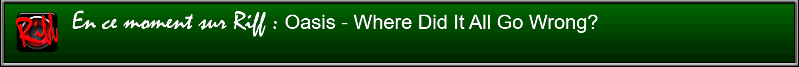

# Comment intégrer les métadonnées de Riff dans une scène OBS Studio

## Présentation

Ce guide vous permettra d'intégrer les métadonnées concernant le contenu en cours de diffusion sur Riff (artiste et titre) dans une scène OBS Studio, avec une mise en forme pour l'adapter à la direction artistique de votre stream ou vidéo.

### Prérequis

Ce guide part du principe que vous avez installé et savez utiliser [OBS Studio](https://obsproject.com). Vous devez savoir créer une scène et ajouter des sources. À ce stade, nous partons de l'idée que vous avez déjà créé une scène, dans laquelle vous souhaitez ajouter les métadonnées.

Vous devez également connaître les fondamentaux de la syntaxe HTML et CSS.

## 1. Ajouter une nouvelle source Navigateur à votre scène

Cliquez sur l'icône **+** et choisissez une source Navigateur web. Sélectionnez **Créer une nouvelle source** et donnez-lui le nom de votre choix. Dans notre exemple, nous l'appellerons « Metariff ».

## 2. Configurer l'URL, la largeur et la hauteur de la source

Dans le champ URL, saisissez `https://api.riff-radio.org/0/auto.php`.

Choisissez ensuite la largeur et la longueur de votre choix en fonction de la taille du cadre dans lequel vous comptez ajouter. Par exemple, 1200 par 300.

## 3. Configurer le débit d'images (facultatif)

Ces métadonnées n'étant pas une source animée, vous pouvez faire le choix d'alléger la charge CPU/GPU en définissant un débit d'images plus bas. Pour ce faire, cochez la case **Définir manuellement le débit d'images (FPS)**, puis dans le champ **Images par seconde**, saisissez une valeur faible. `10` images par seconde suffisent amplement.

## 4. Aperçu du résultat et retour à la configuration

Commencez par cliquer sur **OK** pour valider vos choix précédents et confirmer que la page fonctionne. Les métadonnées devraient d'ores et déjà s'afficher, en noir sur fond transparent. Si ce n'est pas le cas, vérifiez que l'URL est correcte.

Dans la liste des sources, faites un clic droit sur la source `Metariff`, et cliquez sur **Propriétés** pour revenir sur l'écran de configuration.

## 5. Personnaliser l'apparence des métadonnées via CSS

Pour modifier le CSS de la page, nous avons deux balises adressables : `body`, qui s'applique à la totalité de la page, et `#shoutcastmetacontent`, qui s'applique exclusivement au div contenant les métadonnées proprement dites.

Par défaut, le body de la page est déjà personnalisé par OBS. En l'état, nous allons conserver cette personnalisation à l'identique, elle nous convient.

S'agissant de `#shoutcastmetacontent`, nous allons lui appliquer une couleur blanche, une taille plus raisonnable et une police plus lisible. Ajoutons donc les règles suivantes :

```css
#shoutcastmetacontent { 
    color: white;
    font-weight: bold;
    font-family: Arial, Serif;
    font-size: 48px;
    }
```

## 6. Ajouter un texte avant les métadonnées

Nous allons également faire précéder ces métadonnées d'un texte **« En ce moment sur Riff : »** avec une autre police. Comme nous le voulons sur la même ligne que les métadonnées proprement dites, nous allons utiliser le pseudo-élément ::before plutôt qu'une source OBS distincte. Ajoutez donc les propriétés CSS suivantes :

```css
#shoutcastmetacontent::before {
    font-size: 62px; 
    font-family: Mistral, "Segoe Script", cursive; 
    content: "En ce moment sur Riff\00a0:\00a0";
    }
```

Une fois notre CSS totalement configuré, il doit ressembler à ceci :

```css
body { 
    background-color: rgba(0, 0, 0, 0);
    margin: 0px auto;
    overflow: hidden;
    }

#shoutcastmetacontent { 
    color: white; 
    font-weight: bold; 
    font-family: Arial, Sans-Serif; 
    font-size: 48px;
    }

#shoutcastmetacontent::before {
    font-size: 60px; 
    font-family: Mistral, "Segoe Script", cursive; 
    content: "En ce moment sur Riff\00a0:\00a0";
    }
```

Validez en appuyant sur **OK**.

## 7. Placer la source à l'endroit de votre choix

La source étant finalisée, nous pouvons la placer dans le cadre de notre choix par glisser-déposer. Si besoin, revenez dans les propriétés ajuster la taille du navigateur et/ou les propriétés CSS de son contenu pour les adapter à votre scène.

## Conclusion

Vous avez normalement un encadré contenant les métadonnées de Riff, précédé d'un texte **« En ce moment sur Riff »**, blanc sur fond transparent. Celui-ci doit se mettre à jour automatiquement avec la programmation de Riff à raison d'une actualisation toutes les 3 secondes. Vous pourrez obtenir un résultat tel que celui-ci :



### Étapes suivantes

- Pour afficher la durée du morceau et le temps écoulé, [consultez la référence de l'API](reference-api.md).
- Pour ajouter des filtres à votre source Navigateur, [consultez la documentation d'OBS](https://obsproject.com/kb/filters-guide).
